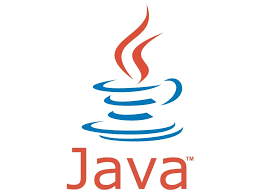

## Hola👋
# Me llamo Ana Maria

Soy estudiante del grado de ingenieria informatica en la universidad de Las Palmas de Gran Canaria

Ademas complemento mis estudios en la universidad haciendo cursos online en OpenBootcamp

## Lenguajes que manejo 

## Herramientas de diseño

## Estoy aprendiendo: 

